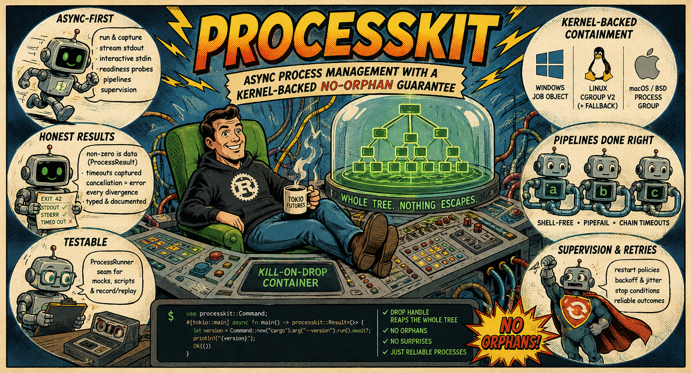

<div style="text-align:center; padding:1.5em 0 0.8em;">
  <h1 style="font-size:3em; font-weight:800; letter-spacing:-0.03em; margin:0 0 0.15em;">ProcessKit</h1>
  <p style="font-size:1.05em; opacity:0.65; margin:0;">Async child-process management for Rust</p>
</div>



[](https://crates.io/crates/processkit)
[](https://docs.rs/processkit)
[](https://github.com/ZelAnton/ProcessKit-rs)

ProcessKit is an async child-process management library for Rust (tokio). It solves
the orphan-process problem at the kernel level and packages a full set of tools
around it: streaming I/O, shell-free pipelines, supervision, and hermetic testing seams.

Running external programs is part of everyday software: compiling code, querying
version control, invoking CLI tools, managing background servers. Every major
runtime makes it easy to start a child process. What they don't make easy is
cleaning up after one.

<div style="display:flex; gap:0.6em; flex-wrap:wrap; margin-bottom:2em;">
  <a href="https://crates.io/crates/processkit" style="display:inline-block; padding:0.35em 0.8em; border:1px solid var(--table-border-color); border-radius:4px; font-size:0.88em; text-decoration:none; color:var(--links);">crates.io ↗</a>
  <a href="https://docs.rs/processkit" style="display:inline-block; padding:0.35em 0.8em; border:1px solid var(--table-border-color); border-radius:4px; font-size:0.88em; text-decoration:none; color:var(--links);">docs.rs ↗</a>
  <a href="https://github.com/ZelAnton/ProcessKit-rs" style="display:inline-block; padding:0.35em 0.8em; border:1px solid var(--table-border-color); border-radius:4px; font-size:0.88em; text-decoration:none; color:var(--links);">GitHub ↗</a>
</div>

## The orphan problem

When a build tool spawns compiler workers, when an integration test starts a
local database, when a wrapper script calls the real binary — those grandchildren
exist outside your program's awareness. If your code panics, times out, or drops
a future mid-flight, the direct child may receive a signal. But everything deeper
in the tree keeps running as orphans: ports stay bound, temp files stay open,
CPU keeps spinning. The next test run tries to bind the same port and fails with
"address already in use."

This is not an edge case. It is the default behavior of every process-spawning
API that works at the level of a single pid — including `std::process` and
`tokio::process`.

## Whole-tree containment

ProcessKit solves this at the kernel level. Every process you start lives inside
an operating-system containment object: a **Job Object** on Windows, a
**cgroup v2** on Linux (with a POSIX process-group fallback on hosts without
cgroup delegation), or a **POSIX process group** on macOS and BSDs.

When the Rust value that owns the container is dropped — by normal flow, by an
error propagating through `?`, or by a panic — the kernel kills every member of
the tree. Grandchildren included. This is not a best-effort signal sent to a list
of pids. It is one atomic kernel operation. A child cannot escape the container
by forking quickly; a signal cannot be missed because a descendant already changed
its session.

The library reports the mechanism it actually got — `mechanism()` returns
`JobObject`, `CgroupV2`, or `ProcessGroup` — so you can verify the guarantee
rather than assume it.

## Getting started

```toml
[dependencies]
processkit = "1"
```

A [tokio](https://tokio.rs/) runtime is required. Requires Rust 1.88 or later (MSRV).
The crate is stable at 1.0; breaking changes land only in a new major version.

The simplest case — run a command, get its trimmed stdout, fail on error:

```rust,no_run
use processkit::Command;

#[tokio::main]
async fn main() -> processkit::Result<()> {
    let branch = Command::new("git")
        .args(["branch", "--show-current"])
        .run()
        .await?;
    println!("on branch: {branch}");
    Ok(())
}
```

When you need more than "success or error" — the exit code, both streams,
whether the run timed out — `output_string()` returns the full result without
raising on a non-zero exit:

```rust,no_run
# use processkit::Command;
# #[tokio::main] async fn main() -> processkit::Result<()> {
let result = Command::new("cargo").arg("test").output_string().await?;
if result.timed_out() {
    eprintln!("tests hung; partial output:\n{}", result.stdout());
} else if !result.is_success() {
    eprintln!("exit {}: {}", result.code().unwrap(), result.stderr());
}
# Ok(()) }
```

The key design choice: a non-zero exit is captured data until you explicitly ask
for success. Timeouts are captured in the result. Only cancellation is always
an error — because an abandoned run has no result worth inspecting.

## Feature flags

Each flag is additive. The kill-on-drop guarantee is unconditional in every
configuration.

| Feature | Default | Adds |
|---|---|---|
| `process-control` | ✅ | Signals, suspend/resume, `members()`, `adopt()` |
| `stats` | — | Resource measurement: CPU time, peak memory, `sample_stats`, `profile` |
| `limits` | — | Whole-tree resource caps (implies `stats`) |
| `record` | — | Record/replay cassettes (adds `serde`) |
| `mock` | — | `mockall`-generated `MockRunner` (semver-exempt surface) |
| `tracing` | — | Lifecycle events via the `tracing` crate (never logs argv/env values) |

## Consuming verbs

Every run begins with the same `Command` builder; the verb you end with
determines what you receive:

| What you want | Verb | What you get |
|---|---|---|
| stdout, success required | `run()` | trimmed `String`; non-zero / timeout / kill → typed error |
| full outcome, exit as data | `output_string()` | `ProcessResult` — code, stdout, stderr, `timed_out` |
| just the exit code | `exit_code()` | `i32`; a timed-out run errors instead of returning `-1` |
| a yes/no answer | `probe()` | `bool` — `0` → true, `1` → false, anything else errors |
| a typed value from stdout | `parse(\|s\| …)` | `T`, success required |
| typed value, non-zero ok | `try_parse(\|s\| …)` | `Option<T>` — `None` on non-zero |
| first matching output line | `first_line(\|l\| …)` | `Option<String>` |
| a live handle for streaming | `start()` | `RunningProcess` |

The same vocabulary is available on every layer: `ProcessRunner`,
`ProcessGroup`, `CliClient`.

## Streaming and interactive I/O

For commands that produce large or incremental output, `start()` returns a live
handle you drive yourself. Stream stdout line by line as the child produces it,
with no buffering and no waiting for exit:

```rust,no_run
use processkit::{Command, StreamExt, Finished, Outcome};

#[tokio::main]
async fn main() -> processkit::Result<()> {
    let mut run = Command::new("cargo")
        .args(["build", "--release"])
        .start()
        .await?;

    let mut lines = run.stdout_lines()?;
    while let Some(line) = lines.next().await {
        println!("{line}");
    }
    // Stderr was drained in the background the whole time.
    let Finished { outcome, stderr, .. } = run.finish().await?;
    if outcome != Outcome::Exited(0) {
        eprintln!("build failed:\n{stderr}");
    }
    Ok(())
}
```

For conversational tools — send a request, read the response, repeat —
`keep_stdin_open()` gives you an async writer you can interleave with reads.
The library handles the background stderr drain so the child can never block
on a full pipe while you're busy with stdout.

Readiness probes solve "start a server, then use it" without guessing at an
arbitrary sleep:

```rust,no_run
# use processkit::Command;
# use std::time::Duration;
# #[tokio::main] async fn main() -> processkit::Result<()> {
let mut run = Command::new("my-server").start().await?;

// Wait for the startup banner on stdout:
run.wait_for_line(|l| l.contains("listening on"), Duration::from_secs(10))
    .await?;

// Or wait for a TCP port to accept connections:
run.wait_for_port("127.0.0.1:8080".parse().unwrap(), Duration::from_secs(10))
    .await?;
# Ok(()) }
```

A probe that cannot pass — the child exited, or the deadline elapsed — fails
with `Error::NotReady` and does not kill the child. You decide what to do next.

## Shell-free pipelines

`a | b | c` without a shell string. Stages are connected in-process through a
relay, so there are no quoting rules, no word-splitting, and no injection
surface. All stages share one kill-on-drop group.

```rust,no_run
use processkit::Command;

# #[tokio::main] async fn main() -> processkit::Result<()> {
let authors = (Command::new("git").args(["log", "--format=%an"])
    | Command::new("sort")
    | Command::new("uniq").arg("-c"))
    .run()
    .await?;
println!("{authors}");
# Ok(()) }
```

The outcome follows pipefail semantics: stdout is always the last stage's
output, but the exit code, stderr, and program name are attributed to the
first stage that failed. A stage that legitimately stops reading early — the
classic `producer | head -n1` shape — can be marked `.unchecked_in_pipe()` so
its broken-pipe exit is not counted as a failure.

## Timeouts, retries, and cancellation

`Command::timeout(d)` kills the whole process tree at the deadline. For the
one-shot capture verbs the expiry is part of the result; for the
success-checking verbs it becomes a typed `Error::Timeout` that carries the
partial output captured before the kill — useful for diagnosing what a hung
tool's last words were.

`Command::retry(attempts, backoff, classifier)` replays the run on transient
failure. The classifier sees the typed error — you can match on the exit code,
an `Error::Timeout`, or the captured stderr. A cancelled run is never retried:
the token stays cancelled.

`CancellationToken` (re-exported from `tokio-util`) is the coordinated
shutdown primitive. Wire the same parent token into many jobs via child tokens;
cancelling the parent kills every process tree and every consuming path reports
`Error::Cancelled`.

```rust,no_run
use processkit::{CancellationToken, Command};
use std::time::Duration;

# #[tokio::main] async fn main() -> processkit::Result<()> {
let shutdown = CancellationToken::new();

let job = tokio::spawn({
    let token = shutdown.child_token();
    async move {
        Command::new("long-job")
            .timeout(Duration::from_secs(30))
            .cancel_on(token)
            .run()
            .await
    }
});

// Signal from anywhere — Ctrl-C, sibling failure, UI button:
shutdown.cancel();
# Ok(()) }
```

## Keeping a service alive

Where `retry` answers "replay this one operation until it succeeds," a
`Supervisor` answers "keep this running." It restarts the command on exit per
policy, with bounded restarts, exponential backoff, and per-default jitter so a
restarted fleet doesn't pile back in lockstep:

```rust,no_run
use processkit::{Command, RestartPolicy, Supervisor};
use std::time::Duration;

# #[tokio::main] async fn main() -> processkit::Result<()> {
let outcome = Supervisor::new(Command::new("my-server").args(["--port", "8080"]))
    .restart(RestartPolicy::OnCrash)
    .max_restarts(10)
    .backoff(Duration::from_millis(200), 2.0)
    .storm_pause(Duration::from_secs(15))  // crash-loop guard
    .run()
    .await?;

println!("ended after {} restarts: {:?}", outcome.restarts, outcome.stopped);
# Ok(()) }
```

The optional storm guard distinguishes "fails occasionally" from "crash-looping":
it maintains a half-life score that grows with each failure and decays between
them. When the score exceeds a threshold, the supervisor takes one collective
pause rather than hammering the restart timer at backoff speed.

## Resource limits

With the `limits` feature, a `ProcessGroup` can cap the whole tree's memory,
process count, and CPU at creation time — enforced by the same kernel object that
provides kill-on-drop:

```rust,no_run
use processkit::{Command, ProcessGroup, ProcessGroupOptions};

# #[tokio::main] async fn main() -> processkit::Result<()> {
let group = ProcessGroup::with_options(
    ProcessGroupOptions::default()
        .memory_max(512 * 1024 * 1024)  // 512 MiB across the whole tree
        .max_processes(64)
        .cpu_quota(0.5),                 // half of one core
)?;
let _job = group.start(&Command::new("untrusted-tool")).await?;
# Ok(()) }
```

A limit that cannot be enforced — no cgroup delegation, no Job Object — is a
hard error at group creation time, not a silently unapplied cap. An unapplied
cap is no protection.

## Testing code that shells out

Subprocess behavior is notoriously difficult to test. ProcessKit exposes a
single trait — `ProcessRunner` — that decouples "what to run" from "how to
run it." Production code takes a runner generically; tests inject a double.

```rust,no_run
use processkit::{Command, ProcessRunner, ProcessRunnerExt, Result};

async fn current_branch(runner: &impl ProcessRunner) -> Result<String> {
    runner.run(&Command::new("git").args(["branch", "--show-current"])).await
}
```

The `ScriptedRunner` returns canned replies for matched commands. The
`RecordingRunner` captures every invocation for assertion. With the `record`
feature, `RecordReplayRunner` records real runs to a JSON cassette and replays
them in CI — fast, hermetic, byte-stable, no subprocess. The seam covers
streaming too: a scripted `start()` feeds canned lines through the same pump
machinery the real child uses, so `stdout_lines`, `wait_for_line`, and `finish`
all behave identically in tests.

The `cli_client!` macro generates typed wrappers around external tools (`git`,
`gh`, `kubectl`, …) that are injectable for free:

```rust,no_run
use processkit::{cli_client, ProcessRunner, Result};
use std::path::Path;

cli_client!(pub struct Git => "git");

impl<R: ProcessRunner> Git<R> {
    pub async fn head(&self, dir: &Path) -> Result<String> {
        self.core.run(self.core.command_in(dir, ["rev-parse", "HEAD"])).await
    }
}

// In production: Git::new().head(Path::new(".")).await
// In tests:      Git::with_runner(ScriptedRunner::new().on([…], Reply::ok("abc\n")))
```

## How it compares

| | whole-tree kill-on-drop | async | limits / stats | streaming · pipelines · supervision |
|---|:---:|:---:|:---:|:---:|
| `std::process` | — | — | — | — |
| `tokio::process` | — | ✓ | — | — |
| [`command-group`](https://crates.io/crates/command-group) | ✓ | ✓ | — | — |
| [`async-process`](https://crates.io/crates/async-process) | — | ✓ (smol) | — | — |
| [`duct`](https://crates.io/crates/duct) | — | — | — | pipelines only |
| **processkit** | ✓ | ✓ (tokio) | ✓ | ✓ |

The first column is the differentiator: descendants are contained and reaped as
a unit, not just the direct child.

## Guides

The [Cookbook](cookbook.md) maps "I want to do X" directly to a working snippet —
the fastest way in. The individual guides go deeper on each topic:

| Guide | Covers |
|---|---|
| [Cookbook](cookbook.md) | Task-to-snippet recipes for every capability |
| [Running commands](commands.md) | The full `Command` builder, every verb, error semantics |
| [Process groups](process-groups.md) | Containment, teardown, signals, suspend/resume, limits, stats |
| [Streaming & interactive I/O](streaming.md) | Line streaming, interactive stdin, readiness probes, profiling |
| [Pipelines](pipelines.md) | Shell-free chains, pipefail attribution, chain timeouts |
| [Timeouts, retries & cancellation](timeouts-and-cancellation.md) | Deadlines, retry classifiers, `CancellationToken` |
| [Supervision](supervision.md) | Restart policies, backoff & jitter, storm guard, outcomes |
| [Testing your code](testing.md) | `ProcessRunner` seam, scripted/recording/cassette doubles, `CliClient` |
| [Platform support](platform-support.md) | Mechanisms, capability matrices, platform caveats |
| [Upgrading](upgrading.md) | Per-version migration notes |

API reference: [docs.rs/processkit](https://docs.rs/processkit).

## What's next

ProcessKit is a Rust library today, published as
[processkit](https://crates.io/crates/processkit) on crates.io. The plan is
to bring the same approach — kernel-backed whole-tree containment, honest
error semantics, and testable seams — to other ecosystems: a Go package,
an F# library, a Kotlin library, and a Python wrapper. Each implementation
will follow the same philosophy and be documented here as it ships.

<div style="margin-top: 3em; padding: 0.9em 1.2em; border: 1px solid var(--table-border-color); border-radius: 4px; font-size: 0.88em; opacity: 0.8; line-height: 1.6;">

**A note on development.** This project was built with significant assistance
from AI tools throughout the design and implementation process. That said, every
line of code was read, understood, and deliberately chosen — this is not
generated output dropped into a repository unchecked. The author takes full
responsibility for correctness, API design, and the published result.

</div>
